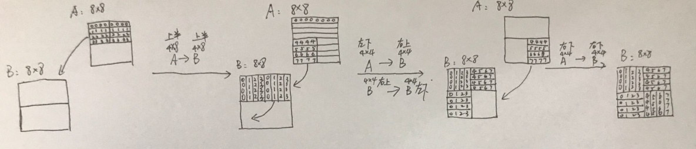

# Cache lab

## Part A 写一个高速缓存模拟器

Valgrind执行一个可执行文件，将其访问内存的轨迹打印出来。

```
valgrind --log-fd=1 --tool=lackey -v --trace-mem=yes traces/yi2.trace
```

Valgrind存储轨迹形式:

[space]operation address,size

```
I 0400d7d4,8  加载0400d7d4地址的8个字节作为指令 instruction load
 M 0421c7f0,4  修改0421c7f0地址的4个字节作为数据 data modify
 L 04f6b868,8  加载04f6b868地址的8个字节作为数据 data load 
 S 7ff0005c8,8 存储04f6b868地址的8个字节作为数据 data store
```
注意'M','L','S'之前有空格，'I'之前没有空格。

参考模拟器的命令

```
./csim-ref [-hv] -s <s> -E <E> -b <b> -t <tracefile>

-s <s> set索引位数   2^s=# of set
-E <E> :连接性 每个set的line数目
-b <b>:每个block的位数  B=2^b=block size
-t <tracefile> : 复现的valgrind轨迹 
```

这部分的目标就是通过填充scim.c文件使得其命令行输入和输出都和参考模拟器csim-ref相同。你需要从0开始写起。

要求:(1)对于任意s,E,b都可以正确模拟--需要对模拟器中的数据结构调用malloc函数。
(2) 忽略所有指令缓存存取('I'),只考虑数据缓存存取
(3) 这里假设所有数据都是合适的对齐的，也就是说不会出现一个内存读取会跨过块的边界。因此可以忽略valgrind轨迹中对于大小的要求

这一部分的测试方法是，执行一下8个case。可以首先使用csim-ref获得正确的答案。在调试阶段加入-v命令用以查看每个hit和miss的


测试阶段只需执行(先make，再执行测试文件，注意要修改该文件权限为"允许作为程序执行文件")

```
make
./test-csim
```

eviction是指tag不匹配，原始的tag被驱逐且替代(If tag doesn’t match: old line is evicted and replaced)

**具体程序编写部分**

使用命令查看如何在c文件中使用命令行
```
man 3 getopt
```


## Part B 优化矩阵转置

目标是在tans.c文件中改写函数transpose_submit，该函数实现一个高效矩阵转置函数。实现缓存miss的最小化。

要求(1) 允许在转置函数中定义12个局部int变量
(2)不允许使用大于int的数据类型(比如long)
(3)不允许使用递归
(4)使用其它帮助函数引入局部变量使得栈上的变量数目大于12也是违反规则的 
(5)不能修改数组A，可以修改数组B。
(6)不能定义数组和使用malloc

在测试阶段会使用三个不同大小的数组,允许针对不同的输入规模分别实现优化的代码。
```
• 32 × 32 (M = 32, N = 32)
• 64 × 64 (M = 64, N = 64)
• 61 × 67 (M = 61, N = 67)
```

测试阶段只需执行(先make，再执行测试文件，注意要修改该文件权限为"允许作为程序执行文件")


获得最终结果
```
make
./test-trans -M 32 -N 32
./test-trans -M 64 -N 64
./test-trans -M 61 -N 67
```

```
./tracegen -M 64 -N 64 -F 0 
#利用检测A B数组是否符合转置的程序将数组钱20个元素地址答应出来
A数组地址:0x602100,B数组地址:0x642100
A数组地址:0x602104,B数组地址:0x642200
A数组地址:0x602108,B数组地址:0x642300
A数组地址:0x60210c,B数组地址:0x642400
A数组地址:0x602200,B数组地址:0x642104
A数组地址:0x602204,B数组地址:0x642204
A数组地址:0x602208,B数组地址:0x642304
A数组地址:0x60220c,B数组地址:0x642404
A数组地址:0x602300,B数组地址:0x642108
A数组地址:0x602304,B数组地址:0x642208
A数组地址:0x602308,B数组地址:0x642308
A数组地址:0x60230c,B数组地址:0x642408
A数组地址:0x602400,B数组地址:0x64210c
A数组地址:0x602404,B数组地址:0x64220c
A数组地址:0x602408,B数组地址:0x64230c
A数组地址:0x60240c,B数组地址:0x64240c
A数组地址:0x602110,B数组地址:0x642500
A数组地址:0x602114,B数组地址:0x642600
A数组地址:0x602118,B数组地址:0x642700
A数组地址:0x60211c,B数组地址:0x642800
```

```

测试运行轨迹
./csim -v -s 5 -E 1 -b 5 -t trace.f0 #利用PartA写的程序将需要的部分打印出来

tag:6664,idx:8 S 68210c,1  miss
tag:6664,idx:9 L 682120,8  miss
tag:6664,idx:8 L 682104,4  hit
tag:6664,idx:8 L 682100,4  hit


tag:6152,idx:8 L 602100,4  miss eviction
tag:6408,idx:8 S 642100,4  miss eviction
tag:6152,idx:8 L 602104,4  miss eviction
tag:6408,idx:16 S 642200,4  miss
tag:6152,idx:8 L 602108,4  hit
tag:6408,idx:24 S 642300,4  miss
tag:6152,idx:8 L 60210c,4  hit
tag:6409,idx:0 S 642400,4  miss
tag:6152,idx:16 L 602200,4  miss eviction
tag:6408,idx:8 S 642104,4  miss eviction
tag:6152,idx:16 L 602204,4  hit
tag:6408,idx:16 S 642204,4  miss eviction
tag:6152,idx:16 L 602208,4  miss eviction
tag:6408,idx:24 S 642304,4  hit
tag:6152,idx:16 L 60220c,4  hit
tag:6409,idx:0 S 642404,4  hit
hits:8 misses:12 evictions:7
```
64x64矩阵转置方法图解



## 两个part结合

```
./driver.py

```

## 单词
verbose 冗长的，唠叨的
parse 解析
eviction 驱逐